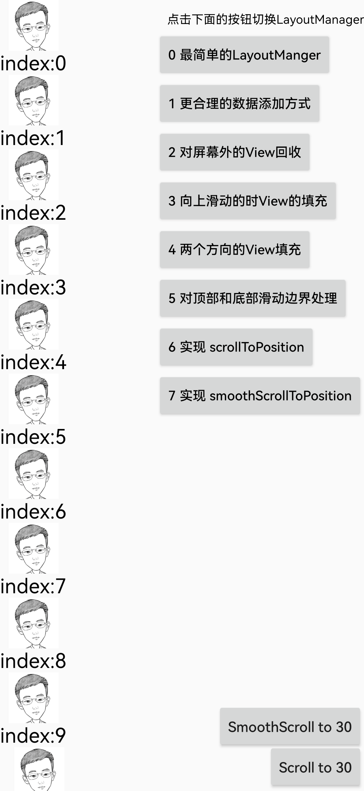

# LayoutManagerGradually

自定义 LayoutManager 的渐进式实现，适合 LayoutManager 初学者对整体流程的一个了解

## 最终效果

一个最简单的 LinearLayoutManager（只支持 LinearLayoutManager.VERTICAL）方向，实现以下逻辑
   - 数据填充只需要填充屏幕范围内的 ItemView
   - 回收掉屏幕以外的ItemView
   - 屏幕外 ItemView 再回到屏幕后数据需要重新填充
   - 对滑动边界边界进行处理
   - 对 scrollToPosition 进行支持
   - 对 smoothScrollToPosition 进行支持

整体代码分为多个文件，每个文件都是对前一段代码的补充，方便理解

## 逐步实现

### 最简单的 LayoutManager

### 更合理的数据添加方式

### 对屏幕外的View回收

### 向上滑动的时View的填充

### 两个方向的View填充

### 对顶部和底部滑动边界处理

### 实现 scrollToPosition

### 实现 smoothScrollToPosition

