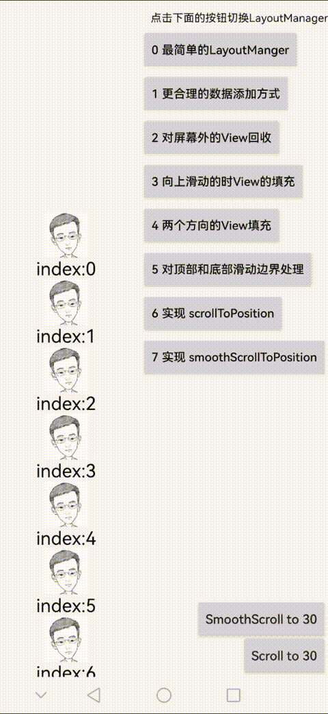
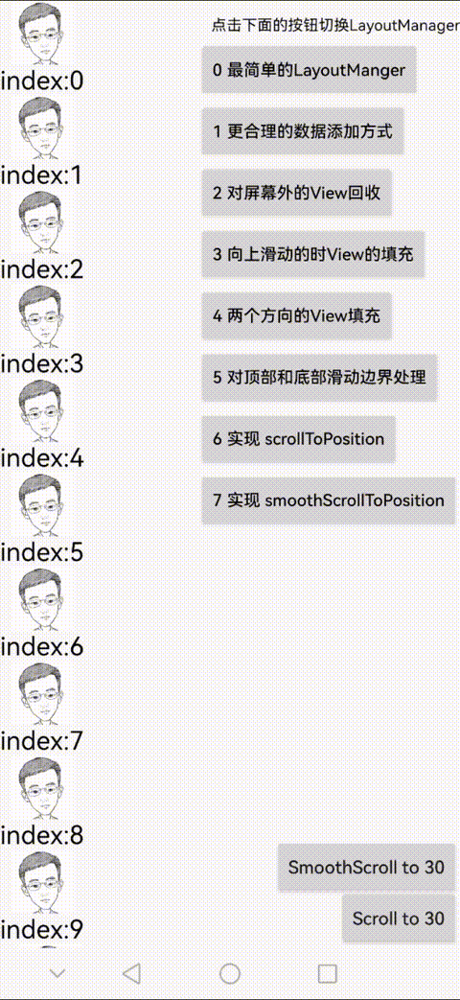

# LayoutManagerGradually

自定义 LinearLayoutManager 的渐进式实现，最终实现一个简单的 LinearLayoutManager（只支持 LinearLayoutManager.VERTICAL 滚动方向）。该工程适合对 LayoutManager 整体流程的学习与理解，整个 LinearLayoutManager 代码分为多份子文件，每个文件都是对前一段代码的补充，方便理解。

## 最终效果

实现以下逻辑

- 数据填充只需要填充屏幕范围内的 ItemView
- 回收掉屏幕以外的ItemView
- 屏幕外 ItemView 再回到屏幕后数据需要重新填充
- 对滑动边界边界进行处理
- 对 scrollToPosition 进行支持
- 对 smoothScrollToPosition 进行支持

## 逐步实现

### 0 最简单的 LayoutManager

[MostSimpleLayoutManager.kt](layoutmanager/src/main/java/com/julis/layoutmanager/series/MostSimpleLayoutManager.kt)

### 1 更合理的数据添加方式

[LinearLayoutManager1.kt](layoutmanager/src/main/java/com/julis/layoutmanager/series/LinearLayoutManager1.kt)

### 2 对屏幕外的View回收

[LinearLayoutManager2.kt](layoutmanager/src/main/java/com/julis/layoutmanager/series/LinearLayoutManager2.kt)

### 3 向上滑动的时View的填充

[LinearLayoutManager3.kt](layoutmanager/src/main/java/com/julis/layoutmanager/series/LinearLayoutManager3.kt)

### 4 两个方向的View填充

[LinearLayoutManager4.kt](layoutmanager/src/main/java/com/julis/layoutmanager/series/LinearLayoutManager4.kt)

### 5 对顶部和底部滑动边界处理

[LinearLayoutManager5.kt](layoutmanager/src/main/java/com/julis/layoutmanager/series/LinearLayoutManager5.kt)

### 6 实现 scrollToPosition

[LinearLayoutManager6.kt](layoutmanager/src/main/java/com/julis/layoutmanager/series/LinearLayoutManager6.kt)

### 7 实现 smoothScrollToPosition

[LinearLayoutManager7.kt](layoutmanager/src/main/java/com/julis/layoutmanager/series/LinearLayoutManager7.kt)  

